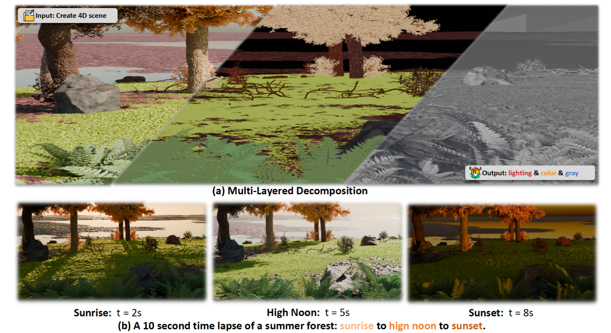

# Code2Worlds: Empowering Coding LLMs for 4D World Generation

This is the official repository for the paper:
> **Code2Worlds: Empowering Coding LLMs for 4D World Generation**
>
> Yi Zhang\*, Yunshuang Wang\*, [Zeyu Zhang](https://steve-zeyu-zhang.github.io/)\*<sup>†</sup>, and Hao Tang<sup>‡</sup>
>
> School of Computer Science, Peking University
>
> \*Equal contribution. <sup>†</sup>Project lead. <sup>‡</sup>Corresponding author
>
> ### [Paper](https://arxiv.org/abs/2602.11757) | [Website](https://aigeeksgroup.github.io/Code2Worlds) | [Code4D](https://huggingface.co/datasets/AIGeeksGroup/Code4D) | [HF Paper](https://huggingface.co/papers/2602.11757)

> [!NOTE]
> 💪 This project demonstrates the capability of coding LLMs in generating dynamic 4D worlds through code-based approaches.

## ✏️ Citation
If you find our code or paper helpful, please consider starring ⭐ us and citing:
```bibtex
@article{zhang2026code2worlds,
  title={Code2Worlds: Empowering Coding LLMs for 4D World Generation},
  author={Zhang, Yi and Wang, Yunshuang and Zhang, Zeyu and Tang, Hao},
  journal={arXiv preprint arXiv:2602.11757},
  year={2026}
}
```
---

## 🏃 Intro Code2Worlds
Achieving spatial intelligence requires moving beyond visual plausibility to build world simulators grounded in physical laws. While coding LLMs have advanced static 3D scene generation, extending this paradigm to 4D dynamics remains a critical frontier. This task presents two fundamental challenges: multi-scale context entanglement, where monolithic generation fails to balance local object structures with global environmental layouts; and a semantic-physical execution gap, where open-loop code generation leads to physical hallucinations lacking dynamic fidelity. We introduce **Code2Worlds**, a framework that formulates 4D generation as language-to-simulation code generation. First, we propose a dual-stream architecture that disentangles retrieval-augmented object generation from hierarchical environmental orchestration. Second, to ensure dynamic fidelity, we establish a physics-aware closed-loop mechanism in which a Post-Process Agent scripts dynamics, coupled with a VLM-Motion Critic that performs self-reflection to iteratively refine simulation code.Evaluations on the Code4D benchmark show Code2Worlds outperforms baselines with a 41% SGS gain and 49% higher Richness, while uniquely generating physics-aware dynamics absent in prior static methods.



## 📰 News
<b>2026/02/15:</b> 🎉 Our paper has been promoted by <a href="https://wx.zsxq.com/topic/55188582511851254"><b>CVer</b></a>.

## TODO List

- [x] Upload our paper to arXiv and build project pages.
- [x] Add a demo.
- [ ] Upload the code.
- [ ] Upload the Code4D


## ⚡ Quick Start
### Environment Setup

1. Clone the repository and Create a conda environment:
```bash
git clone https://github.com/AIGeeksGroup/Code2Worlds.git
cd Code2Worlds
conda create -n code2worlds python=3.11
conda activate code2worlds
pip install -r requirements.txt
```

2. Install Infinigen:
```bash
git clone https://github.com/princeton-vl/infinigen.git
```

Please follow the official Infinigen installation guide at [Infinigen](https://github.com/princeton-vl/infinigen) for detailed installation instructions.

### Create a World

To use LLMs, you need to obtain an API key:

You need to enter your `API_KEY` and `BASE_URL`.
```bash
os.environ["OPENAI_API_KEY"] = "sk-xxxxxxxx"
os.environ["OPENAI_BASE_URL"] = ""
```

Create a target object：
```bash
bash scripts/obj.sh
```

Create a static scene：
```bash
bash scripts/scene.sh
```

Create a dynamic scene (no reflection)：
```bash
python agent/postprocess/postprocess_agent.py
```

Using reflection:
```bash
python agent/postprocess/dynreflection.py
python agent/postprocess/postprocess_agent.py
```

### Render

Nature Scenes: Configured for 1920x1080 resolution, 128 samples.

## 👀 Visualization

<table>
  <tr>
    <td align="center" valign="top">
      <b>Relighting</b>
      <video src="https://aigeeksgroup.github.io/Code2Worlds/assets/videos/scene2.mp4" controls></video><br>
    </td>
    <td align="center" valign="top">
      <b>Raining</b>
      <video src="https://aigeeksgroup.github.io/Code2Worlds/assets/videos/scene4.mp4" controls></video><br>
    </td>
  </tr>
  <tr>
    <td align="center" valign="top">
      <b>Rolling</b>
      <video src="https://aigeeksgroup.github.io/Code2Worlds/assets/videos/scene9.mp4" controls></video><br>
    </td>
    <td align="center" valign="top">
      <b>Burning</b>
      <video src="https://aigeeksgroup.github.io/Code2Worlds/assets/videos/scene7.mp4" controls></video><br>
    </td>
  </tr>
</table>


---

## 🌟 Star History

[](https://www.star-history.com/#username/Code2Worlds&Date)


## 😘 Acknowledgement
We thank the authors of [Infinigen](https://github.com/princeton-vl/infinigen) for their open-source code. 